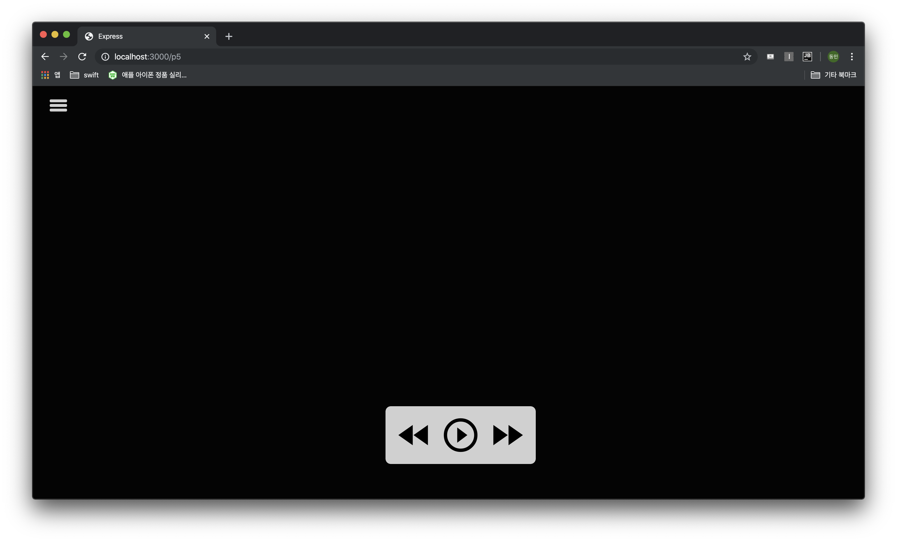
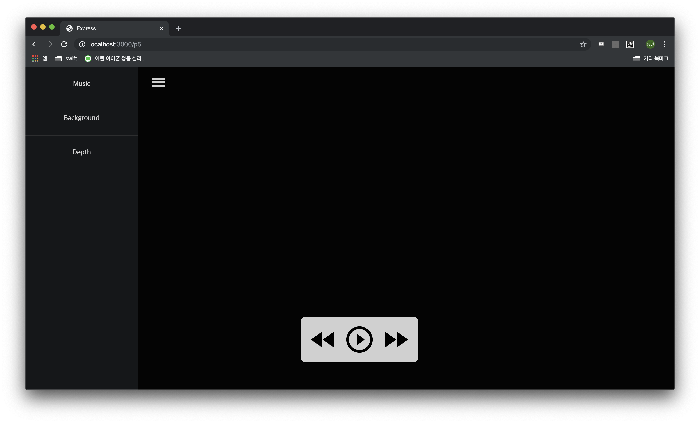
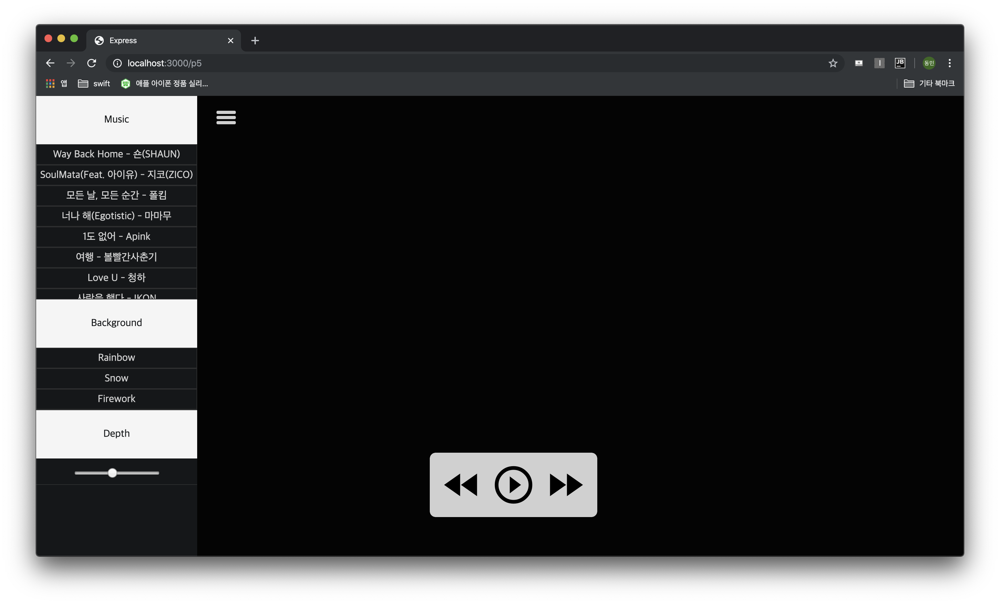
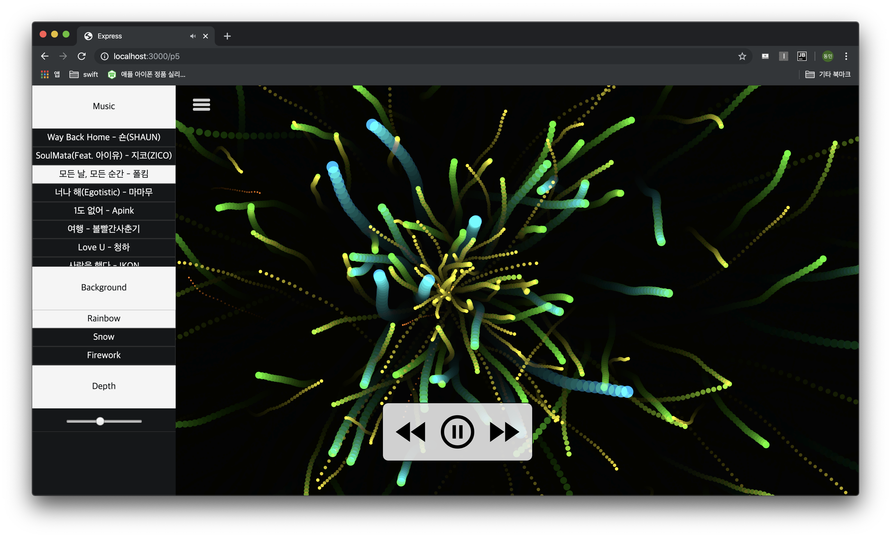
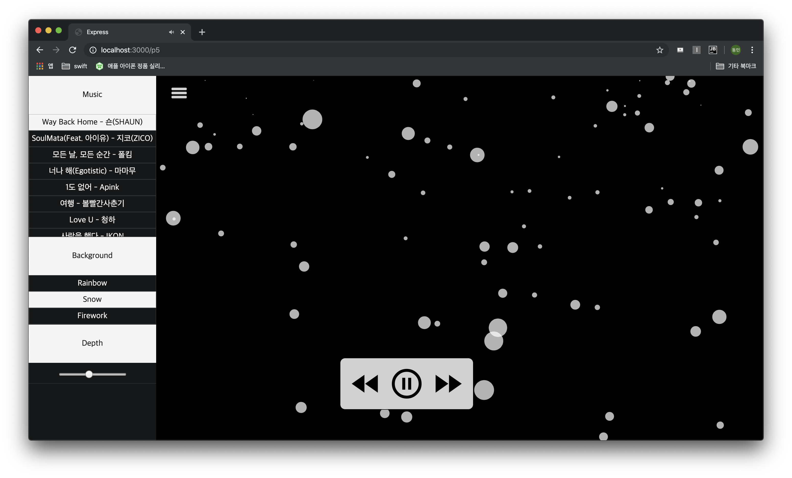
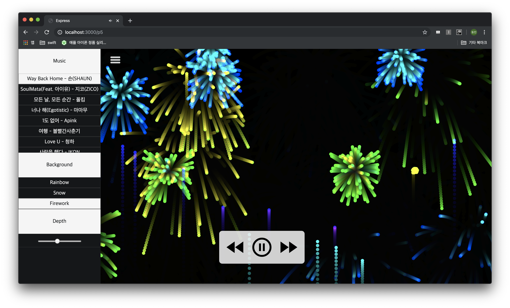

# SoundVisualization
### 개요

✅ 미디어 멤버쉽 프로젝트

✅ 기간 

- 2018.12 ~ 2019.02

### 소개

✅ Mic, 내장 Sound 등을 활용 Sound의 파장을 분석해 여러가지 형태로 시각화

### 기능

✅ 음악 리스트에서 음악 선택 가능

✅ 사운드를 시각화시킬 형태 선택 가능

✅ 시각화 시킬 떄, Depth 선택 가능

✅ 음악 10초 앞으로, 10초 뒤로, 일시정지, 재생 기능

### 사용 기술

✅ 서버 : `Node.JS`

✅ 프론트 : `HTML`, `CSS`, `JavaScript`

✅ 라이브러리 : `JQuery`, `p5.js`

### 실행화면

🔵 **메인 화면**

🔵 **실행화면**

